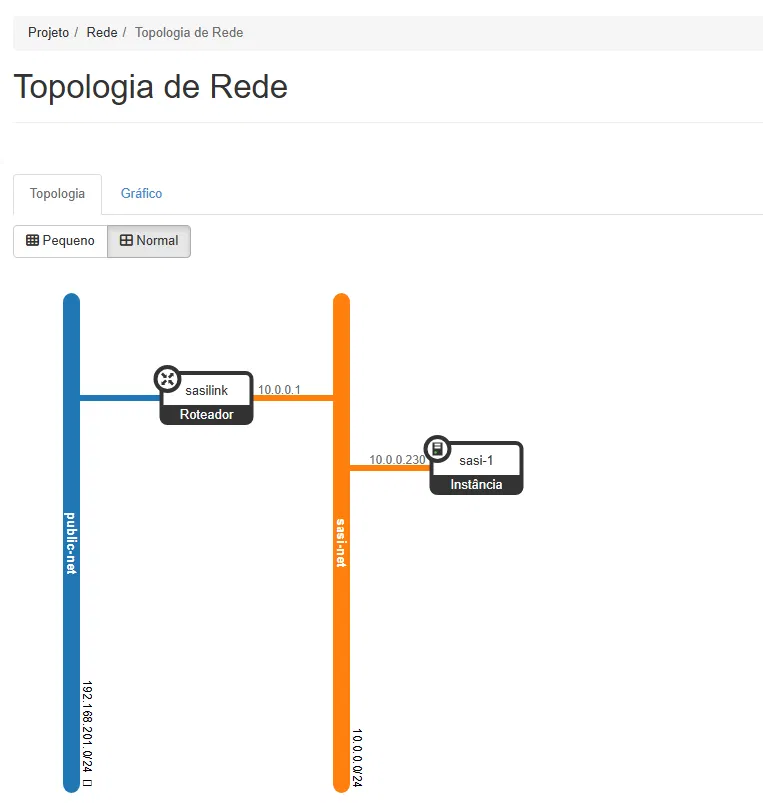
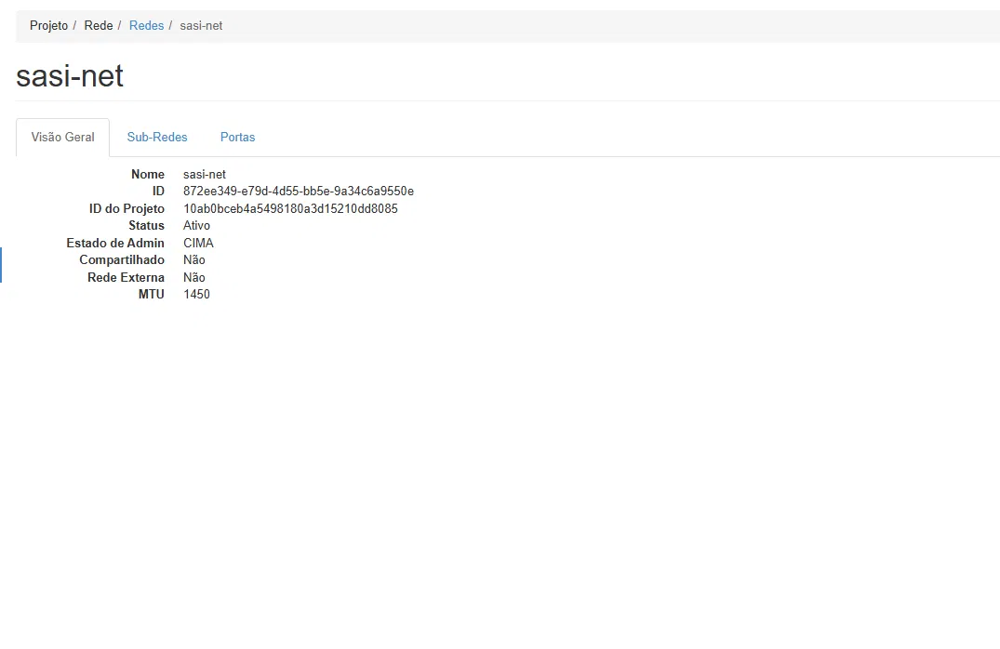
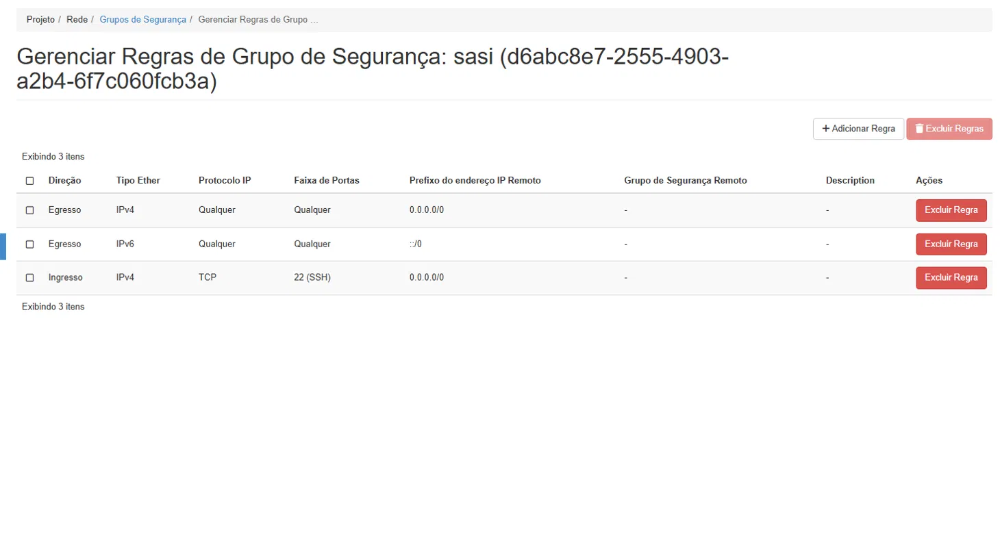

# SASI: Sistema de Assistência e Suporte Inteligente

**InovaTech Lab · Unipar Umuarama · Paraná, Brazil**

SASI is a voice-driven AI assistant deployed on private infrastructure for InovaTech, the innovation laboratory of Universidade Paranaense (Unipar). The system answers questions about lab equipment inventory and staff, processes spoken input through a speech-to-text pipeline, generates responses via a large language model, and synthesizes speech output through a text-to-speech engine. All components run inside Docker containers orchestrated on an OpenStack virtual machine hosted within the university network.

This document describes the full architecture, infrastructure setup, bugs encountered during development, security decisions made, and the current state of the implementation. It is written as an honest account of real engineering work, including mistakes and how they were corrected.

---

## Table of Contents

1. [Project Overview](#1-project-overview)
2. [Architecture](#2-architecture)
3. [OpenStack Infrastructure](#3-openstack-infrastructure)
4. [Docker and Application Setup](#4-docker-and-application-setup)
5. [Bugs Encountered and Solutions](#5-bugs-encountered-and-solutions)
6. [Performance Benchmarks](#6-performance-benchmarks)
7. [Security Decisions](#7-security-decisions)
8. [Pending Implementation](#8-pending-implementation)
9. [Project Structure](#9-project-structure)

---
    
## 1. Project Overview

InovaTech Lab operates a server room with legacy hardware and a cluster of Chromebooks available for general use. The goal of SASI is to provide an intelligent interface for visitors and lab members to query information about equipment and personnel without requiring any technical knowledge. Interaction happens through a Dell touchscreen PC positioned at the lab entrance, equipped with an integrated microphone, speakers, and camera.

The system was designed around three constraints:

**Latency.** Voice interaction requires responses fast enough to feel conversational. Local LLM inference on the available CPU hardware proved structurally inadequate, which led to the decision to use the Groq cloud API as the primary inference engine, with local Ollama as a fallback.

**Privacy.** The configuration, system prompt, and infrastructure must not be accessible to general lab users. Only the voice input and output interface is exposed on the Dell PC.

**Resilience.** If the Groq API is unavailable, the system falls back to a locally running model via Ollama, maintaining partial functionality without internet access.

---

## 2. Architecture

### 2.1 Infrastructure

| Component | Details |
|---|---|
| VM name | sasi-1 |
| Floating IP | 192.168.201.133 |
| Private IP | 10.0.0.230 |
| OS | Ubuntu 22.04 LTS |
| vCPUs | 8 (Intel Xeon Westmere E56xx) |
| RAM | 32 GB DDR3 |
| GPU | None |
| AVX2 | Not supported (2010 architecture) |
| OpenStack flavor | ai.caio.super |

### 2.2 Docker Services

Five containers run inside the same internal bridge network (`inovatech-net`):

| Service | Image | Port | Role |
|---|---|---|---|
| backend | inovatech-ai-backend (local build) | 8080 | FastAPI, orchestrates all services |
| ollama | ollama/ollama:latest | 11434 | Local LLM fallback |
| chromadb | chromadb/chroma:0.5.3 | 8000 | Vector database for future RAG |
| piper | rhasspy/wyoming-piper:latest | 10200 (internal) | Text-to-speech synthesis |
| whisper | linuxserver/faster-whisper:latest | 10300 (internal) | Speech-to-text transcription |

Piper and Whisper do not expose ports to the host. They are only reachable by the backend container through the internal Docker network. This follows the principle of minimal exposure.

### 2.3 Request Flow

```
User speaks into microphone (Dell PC)
        ↓
Browser captures audio via MediaRecorder API
        ↓
POST /transcribe  →  faster-whisper (port 10300)  →  returns text
        ↓
POST /chat  →  Groq API (primary) or Ollama (fallback)  →  returns text
        ↓
POST /speak  →  wyoming-piper (port 10200)  →  returns WAV audio
        ↓
Browser plays audio through speakers
Mascot animation syncs with playback state
```

### 2.4 LLM Strategy

The FastAPI backend attempts the Groq API first on every request. If any exception is raised (network error, quota exceeded, API outage), it silently falls back to Ollama. The response payload includes a `backend` field indicating which engine answered, which is useful for debugging.

```json
{
  "response": "Olá, sou o SASI...",
  "model": "llama-3.1-8b-instant",
  "backend": "groq"
}
```

### 2.5 Voice Protocol

Piper and Whisper communicate using the Wyoming protocol, a lightweight binary protocol over TCP developed by the Rhasspy/Nabu Casa community. The FastAPI backend uses the `wyoming` Python library to establish TCP connections to each service, exchange typed events (`Synthesize`, `AudioChunk`, `AudioStop`, `Transcribe`, `Transcript`), and close the connection after each request.

---

## 3. OpenStack Infrastructure

This section documents the full OpenStack provisioning process for sasi-1, including network design, instance configuration, and security group analysis. These decisions are directly relevant to cloud infrastructure security and are presented with that lens in mind.

### 3.1 Project Isolation

The university OpenStack cluster is organized into isolated projects. SASI runs inside Caio_BETA, separate from the shared Inovatech project used for common lab tools. Project isolation is enforced at the API level by Keystone, the OpenStack identity service. Each project has its own quota, network namespace, and security group rules — a misconfiguration inside Caio_BETA cannot directly affect other projects, and other lab members have no access to sasi-1 by default.
OpenStack Project	Purpose
Caio_BETA	SASI development (this project)
Inovatech	Shared lab tools (GitLab, etc.)
Otavio_BETA	Another lab member's personal project

### 3.2 Instance Details

The instance sasi-1 was created on June 11, 2026, using the Ubuntu Server cloud image (ubuntu-server-cloudimg-24.04). The flavor ai.caio.super was provisioned by the lab administrator specifically for this project.
Field	Value
Instance name	sasi-1
Instance ID	67149fba-d31b-468f-943c-fb305d037789
Status	Active
Availability zone	nova
Flavor	ai.caio.super
RAM	32 GB
vCPUs	8
Disk	200 GB
Image	ubuntu-server-cloudimg-24.04
SSH key pair	inovatech-key
Private IP	10.0.0.230 (sasi-net)
Floating IP	192.168.201.133 (public-net)

The disk volume is attached at /dev/sda. The instance uses restart: unless-stopped at the container level, meaning all Docker services recover automatically after a VM reboot without manual intervention.

### 3.3 Network Topology

The network was designed with two layers: a university-wide provider network and a project-specific private subnet connected through a router.

```
public-net  [192.168.201.0/24]   ← university internal provider network
       |
   [sasilink]                    ← router created for this project
   (internal interface: 10.0.0.1)
       |
sasi-net    [10.0.0.0/24]        ← private project subnet (MTU 1450)
       |
   sasi-1
   10.0.0.230  (private)
   192.168.201.133  (floating IP, NAT from public-net)
```

The floating IP 192.168.201.133 is a NAT mapping managed by OpenStack Neutron. When a packet arrives at 192.168.201.133, Neutron translates it to 10.0.0.230 before it reaches the VM. This is functionally equivalent to port forwarding on a home router, but managed at the hypervisor level.

The network sasi-net has the following properties:
Field	Value
Name	sasi-net
CIDR	10.0.0.0/24
Gateway	10.0.0.1 (sasilink router)
MTU	1450
Shared	No
External	No
Admin state	UP

The MTU of 1450 bytes (rather than the standard 1500) accounts for the overhead of the VXLAN encapsulation used by OpenStack Neutron to isolate tenant networks at the hypervisor level. Sending packets larger than 1450 bytes without fragmentation would cause silent packet loss.

### 3.4 Security Groups

The instance is assigned to the security group sasi, which currently defines three rules:
| Direction | Protocol | Port range | Source | Purpose |
|---|---|---|---|---|
| Egress | IPv4 / Any | Any | 0.0.0.0/0 | Allow all outbound traffic |
| Egress | IPv6 / Any | Any | ::/0 | Allow all outbound IPv6 traffic |
| Ingress | TCP | 22 (SSH) | 0.0.0.0/0 | Allow SSH from any source |

Security analysis. The egress rules allow unrestricted outbound traffic, which is necessary for the VM to reach the Groq API over the internet and to pull Docker images from external registries. Restricting egress to specific destinations (Groq API endpoints, Docker Hub, HuggingFace) would follow the principle of least privilege but adds operational complexity during active development.

The ingress SSH rule accepts connections from 0.0.0.0/0, meaning any machine on the university network 192.168.201.0/24 can attempt an SSH connection to port 22. The current protection against unauthorized access relies entirely on key-based authentication: the inovatech-key private key is required, and password authentication is disabled on Ubuntu cloud images by default. Brute-force attacks against the key itself are computationally infeasible with a properly generated RSA or Ed25519 key pair.

The author is aware that the more correct rule would restrict SSH ingress to specific source IPs (the developer's workstation and the lab administrator's machine). This hardening has not been implemented yet because the environment is controlled and access to the 192.168.201.0/24 network requires physical presence in the university building or VPN credentials managed by the lab administrator. Tightening the source IP restriction is listed as a planned security measure and will be applied once the WireGuard VPN is configured and stable IP assignments for authorized machines are known.

Planned hardening:

# replace current SSH rule (source 0.0.0.0/0) with:
ALLOW IPv4 22/tcp from <developer_workstation_ip>/32
ALLOW IPv4 22/tcp from <lab_admin_ip>/32

### 3.5 SSH Access
bash

ssh -i ~/.ssh/inovatech-key ubuntu@192.168.201.133
# -i: specifies the private key file for authentication
# ubuntu: default user on Ubuntu cloud images
# 192.168.201.133: floating IP, reachable only from inside the university network
#                  or through WireGuard VPN (pending configuration)

The key pair inovatech-key was generated during instance creation via OpenStack Horizon and downloaded once. It is stored at ~/.ssh/inovatech-key on the developer's workstation with permissions 400 (owner read-only), which is required by the SSH client:
bash

chmod 400 ~/.ssh/inovatech-key
# 400: owner read only; SSH refuses to use a private key with broader permissions

## 4. Bugs Encountered and Solutions

### Bug 1: Ollama Healthcheck Always Failing

**Problem.** The `docker-compose.yml` defined a healthcheck for the Ollama service using `curl`. The backend was configured with `depends_on: condition: service_healthy`, meaning it would not start until Ollama reported healthy. The backend never started.

**Root cause.** The `ollama/ollama:latest` image does not include `curl` or `wget`. The healthcheck command `CMD curl -f http://localhost:11434/api/tags` always failed with "executable not found", causing Docker to mark the service as unhealthy indefinitely.

**Solution.** The healthcheck was removed entirely from the Ollama service. The backend's `depends_on` was changed to reference only ChromaDB, which uses an image that includes `curl` and has a working healthcheck on `/api/v1/heartbeat`.

### Bug 2: SSH "No Route to Host" After Two Days

**Problem.** SSH connections to `192.168.201.133` suddenly failed with `No route to host` after working normally during the first sessions.

**Root cause.** The floating IP `192.168.201.133` belongs to the university's internal network range `192.168.201.0/24`. This address is not publicly routable. It is only reachable from machines physically or logically connected to the university network. The developer had left the lab and attempted to connect from outside.

**Solution.** Reconnecting from inside the lab restored access immediately. Long-term solution: WireGuard VPN tunnel to be configured by the lab administrator, which will create a route from any external machine to the `192.168.201.0/24` range.

### Bug 3: YAML Indentation Errors When Pasting via SSH

**Problem.** Pasting large blocks of YAML or Python code into the terminal over SSH caused characters to be dropped, reordered, or misinterpreted. This produced invalid YAML that Docker Compose refused to parse, and Python syntax errors that prevented the backend from starting.

**Root cause.** SSH terminals process pasted input character by character at the shell level. Special characters such as quotes, brackets, and indentation triggers are partially interpreted before reaching the target editor. Large pastes amplify this effect.

**Solution.** Three measures were adopted. First, `nano` was used as the editor because it handles paste input more gracefully than `vi`. Second, content was pasted using `Ctrl+Shift+V` in the terminal emulator, which bypasses shell interpretation for most special characters. Third, code was split into small blocks of approximately 15 lines and pasted sequentially. After each edit, the YAML was validated with:

```bash
docker compose config
# parses and validates docker-compose.yml without starting any containers
# prints the resolved configuration if valid, or an error with line number if not
```

Python syntax was validated with:

```bash
python3 -m py_compile scripts/api.py && echo "OK"
# -m py_compile: compiles the file to bytecode without executing it
# exits with a non-zero code and prints the error location if syntax is invalid
```

### Bug 4: faster-whisper Float16 Warning on Westmere CPU

**Problem.** The faster-whisper container logged a warning on startup: the model weights were stored as float16, but the CPU does not support efficient float16 computation.

**Root cause.** Intel Xeon Westmere (2010) predates hardware float16 support. The faster-whisper runtime detected this at initialization.

**Solution.** No action was required. The runtime automatically converted the weights to float32, which the CPU supports natively. The consequence is slightly higher memory usage and marginally slower inference, both acceptable for the `small` model at this scale.

### Bug 5: Piper Returning Raw PCM Instead of WAV

**Problem.** The `/speak` endpoint returned a file that audio players and the `soundfile` Python library refused to open, reporting "Format not recognised."

**Root cause.** The Wyoming protocol exchanges raw PCM audio bytes in `AudioChunk` events. There is no WAV container wrapping this data. The initial implementation concatenated the chunks and returned them directly, producing a file with no RIFF header that no standard audio decoder could interpret.

**Diagnosis.** The first 16 bytes of the output file were inspected directly:

```python
data = open('/tmp/teste.wav', 'rb').read(16)
print(data)
# output: b'\x05\x00\xfc\xff\x00\x00\x01\x00...'
# a valid WAV file always starts with b'RIFF'
```

**Solution.** A standard 44-byte WAV header was constructed manually using Python's `struct.pack` before returning the audio data. The Piper TTS engine operates at 22050 Hz, 16-bit, mono:

```python
import struct

sample_rate = 22050
num_channels = 1
bits_per_sample = 16
byte_rate = sample_rate * num_channels * bits_per_sample // 8
block_align = num_channels * bits_per_sample // 8
data_size = len(pcm_data)

wav_header = struct.pack(
    "<4sI4s4sIHHIIHH4sI",
    b"RIFF", 36 + data_size, b"WAVE",
    b"fmt ", 16, 1,
    num_channels, sample_rate, byte_rate, block_align, bits_per_sample,
    b"data", data_size
)
# "<": little-endian byte order
# "4s": 4-byte string, "I": unsigned 32-bit int, "H": unsigned 16-bit int
```

### Bug 6: Wyoming AsyncTcpClient Missing `writer` Attribute

**Problem.** The `/speak` endpoint raised `'AsyncTcpClient' object has no attribute 'writer'` at runtime.

**Root cause.** The initial implementation used `client.writer` and `client.reader`, assuming they were public attributes. The wyoming library version 1.5.4 stores them as private attributes `_writer` and `_reader`, and does not implement the async context manager protocol. Using `async with AsyncTcpClient(...)` did not call `.connect()`, leaving `_reader` and `_writer` as `None`.

**Diagnosis.** The class source was inspected at runtime without accessing external documentation:

```python
import inspect
from wyoming.client import AsyncTcpClient
print(inspect.getsource(AsyncTcpClient))
# inspect.getsource: returns the source code of a live Python object
# useful when library documentation is absent or outdated
```

**Solution.** `.connect()` and `.disconnect()` are called explicitly. The private attributes `_reader` and `_writer` are accessed directly. A `finally` block guarantees `.disconnect()` runs regardless of success or failure:

```python
client = AsyncTcpClient(PIPER_HOST, PIPER_PORT)
try:
    await client.connect()
    await async_write_event(Synthesize(text=req.text).event(), client._writer)
    # ... read chunks ...
finally:
    await client.disconnect()
    # finally: executes unconditionally, preventing TCP connection leaks
```

### Bug 7 (Security Incident): API Key Exposed in Plain Text

**Severity.** Critical.

**Problem.** The `GROQ_API_KEY` was hardcoded as a plain text value inside `docker-compose.yml` and was inadvertently included in shared output during a development session.

**Root cause.** The key was initially added directly to the `environment` block in `docker-compose.yml` for convenience during early development. No secrets management practice was in place at that stage.

**Incident response procedure followed:**

1. The key was immediately revoked at [console.groq.com/keys](https://console.groq.com/keys). A revoked key stops working the moment it is deleted, regardless of where copies exist.
2. A new key was generated. The new key was copied once and stored only in `.env`.
3. The `docker-compose.yml` was updated to remove all hardcoded secrets. The `env_file` directive was added to the backend service, pointing to `.env`.
4. The `.env` file was restricted to owner-only access: `chmod 600 .env`.
5. The container was force-recreated to inject the new key: `docker compose up -d --force-recreate backend`.
6. The injected value was verified inside the running container: `docker compose exec backend env | grep GROQ`.

**Lesson.** Secrets must never appear in files that are read aloud, shared, or committed to version control. The correct pattern from the beginning of any project is: secrets in `.env`, `.env` in `.gitignore`, `env_file` directive in `docker-compose.yml`. The `.env` file in this repository is listed in `.gitignore` and is never committed.

---

## 5. Performance Benchmarks

All local inference tests were conducted on the OpenStack VM with 8 vCPUs of Intel Xeon Westmere E56xx and 32 GB DDR3 RAM. No GPU was available.

| Model | Tokens/s (CPU) | Notes |
|---|---|---|
| mistral:7b-instruct-q4_K_M | Not measured | First response confirmed working, but latency was prohibitive |
| phi3:mini | 6.8 | Insufficient for voice interaction |
| qwen2.5:0.5b | 12.9 | Closest to usable, still below acceptable threshold |
| Groq API (llama-3.1-8b-instant) | ~600x faster than local | Total round-trip ~16ms |

Voice interaction requires at minimum 30 to 50 tokens per second to feel responsive. The Westmere architecture predates the AVX2 instruction set, which modern LLM runtimes (llama.cpp, CTranslate2) rely on for vectorized matrix operations. Without AVX2, inference throughput is structurally limited regardless of model size or quantization level. The 12.9 tokens/s observed with qwen2.5:0.5b is close to the physical ceiling for this CPU family.

The Groq API resolved this constraint entirely. With llama-3.1-8b-instant, total response time including network round-trip was approximately 16 milliseconds, compared to roughly 10 seconds for local inference. This represents a performance difference of approximately 600 times. The Ollama stack remains in place as a fallback for offline scenarios.

---

## 6. Security Decisions

### Secrets Management

All secrets (API keys, credentials) are stored exclusively in `.env`. This file is never committed to version control. The `env_file` directive in `docker-compose.yml` injects the values into containers at runtime. File permissions are restricted to `600` (owner read/write only).

### Minimal Port Exposure

Only services that must be reachable from outside the Docker network expose host ports. The FastAPI backend exposes port `8080`. Piper and Whisper are internal only and communicate exclusively with the backend through the `inovatech-net` bridge network. Ollama exposes `11434` for administrative access but is not called directly by the frontend.

### SSH Access Control

The VM accepts SSH connections only with the `inovatech-key` private key. Password authentication is disabled by default on Ubuntu cloud images. The key is stored locally by the developer and the lab administrator.

### Planned Security Measures

The following measures are designed but not yet implemented:

- **Kiosk mode on Dell PC.** Chromium launched with `--kiosk --noerrdialogs --disable-session-crashed-bubble`, pointed at `http://192.168.201.133:8080`. The browser cannot be exited or navigated away from.
- **Restricted Linux user.** A dedicated user account on the Dell PC with no terminal access, configured for automatic login that launches the kiosk browser.
- **Rate limiting.** The `slowapi` library will enforce a maximum of one request per five seconds per IP address on the `/chat` endpoint, protecting the Groq free-tier quota.

---

## 7. Pending Implementation

| Feature | Status | Notes |
|---|---|---|
| WAV header construction for Piper PCM output | In progress | `struct.pack` fix written, indentation error on line 130 pending correction |
| Whisper `/transcribe` endpoint test | Blocked | Depends on WAV header fix |
| Frontend HTML/JS interface | Not started | Push-to-talk button, mascot animation, touchscreen support |
| RAG with ChromaDB | Not started | Lab inventory and staff data to be indexed with nomic-embed-text |
| WireGuard VPN | Pending | Lab administrator to configure server side |
| Facial recognition | Not started | InsightFace on Dell camera |
| Kiosk mode | Not started | Chromium flags + restricted user |
| Rate limiting | Not started | slowapi integration |
| LinkedIn and GitHub documentation post | Not started | To be published after core voice pipeline is functional |

---

## 8. Project Structure

```
~/inovatech-ai/
├── docker-compose.yml          # orchestrates all 5 services
├── Dockerfile.backend          # builds the FastAPI container
├── requirements.txt            # Python dependencies for the backend
├── .env                        # secrets (not committed to git)
├── .gitignore                  # includes .env
├── scripts/
│   └── api.py                  # FastAPI application (version 0.3.0)
└── data/
    ├── piper-voices/
    │   ├── pt_BR-faber-medium.onnx       # Piper voice model (61 MB)
    │   └── pt_BR-faber-medium.onnx.json  # voice configuration
    └── whisper-models/
        └── (downloaded automatically by faster-whisper on first boot)
```

### API Endpoints

| Method | Endpoint | Input | Output |
|---|---|---|---|
| GET | `/health` | none | system status JSON |
| POST | `/chat` | JSON `{message, history, model}` | JSON `{response, model, backend}` |
| POST | `/speak` | JSON `{text}` | WAV audio file |
| POST | `/transcribe` | multipart audio file | JSON `{text}` |
| GET | `/models` | none | list of available Ollama models |

---

## Acknowledgements

This project was developed as part of the InovaTech Lab activities at Unipar Umuarama. Infrastructure access and OpenStack administration were provided by lab colleague Codato. Academic supervision by professor Elyssandro Piffer.

---

*SASI version 0.3.0 · June 2026*
